1.修改nacos配置文件
打开这两个配置
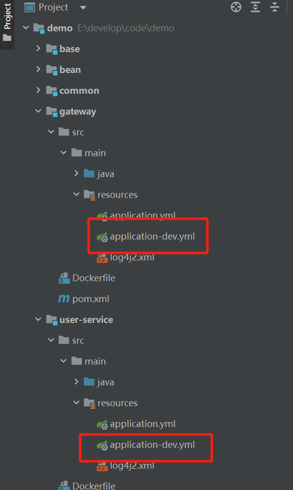
把这个改为你的nacos的ip
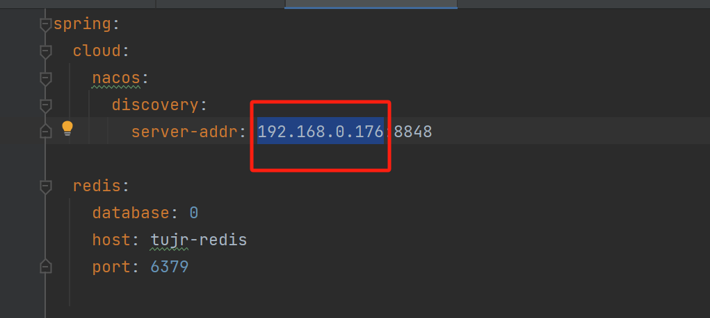

2.执行 mvn clean install
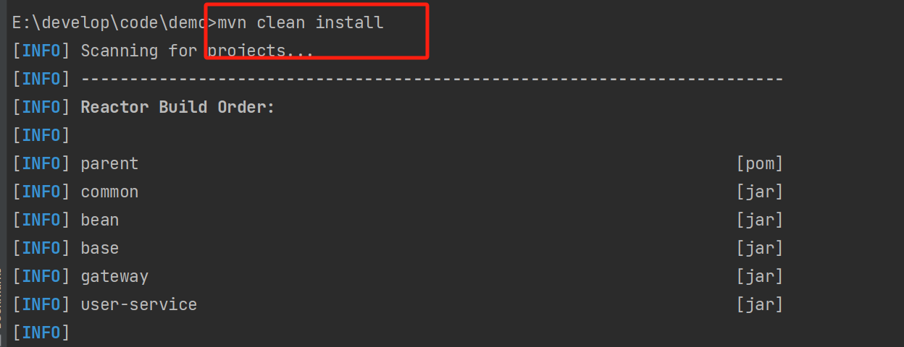

3.执行  docker-compose up
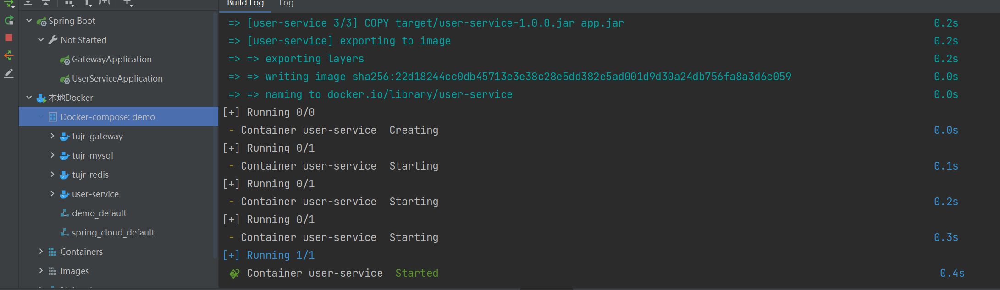

4. 访问接口文档
http://localhost:7573/doc.html#/home
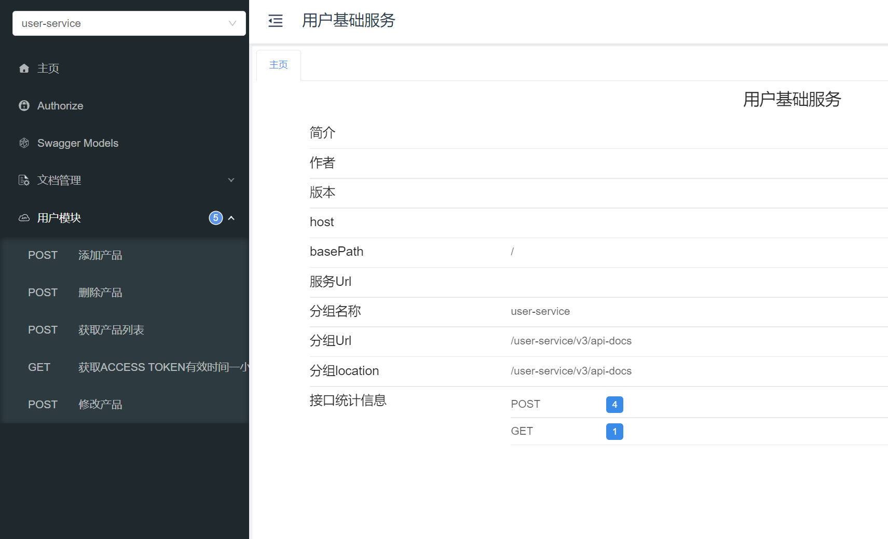

5，调用接口获取token
取消传入请求头
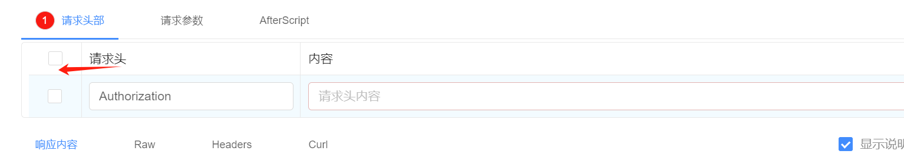
输入账号密码
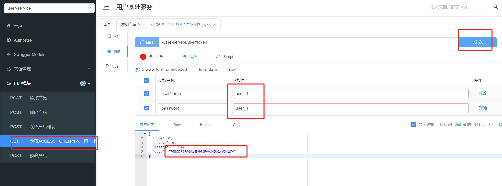
得到token

6.调用获取列表接口
传入token，调用接口，获取到列表
token 格式Bearer 76BDDF5F96914D668FAA8A5024650274
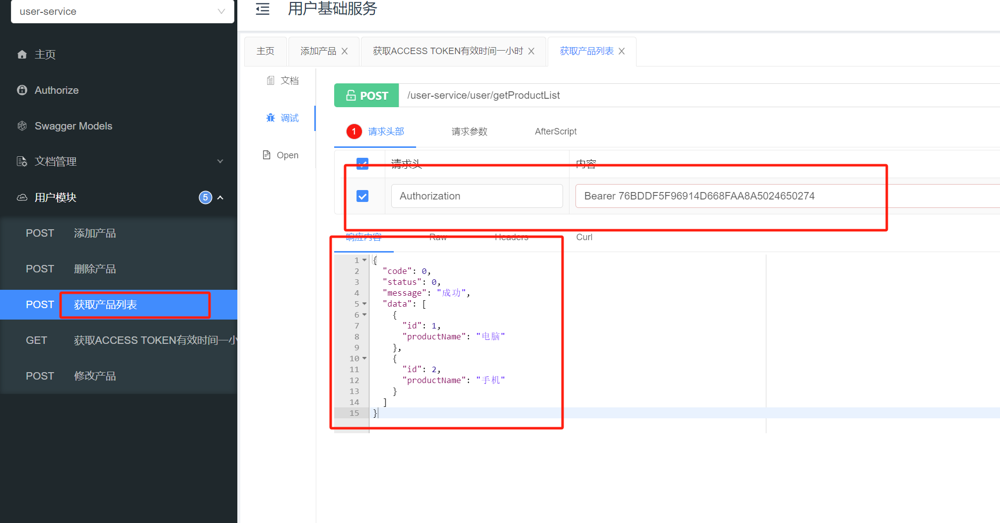

7.切换用户editor_1
获取editor_1用户的token
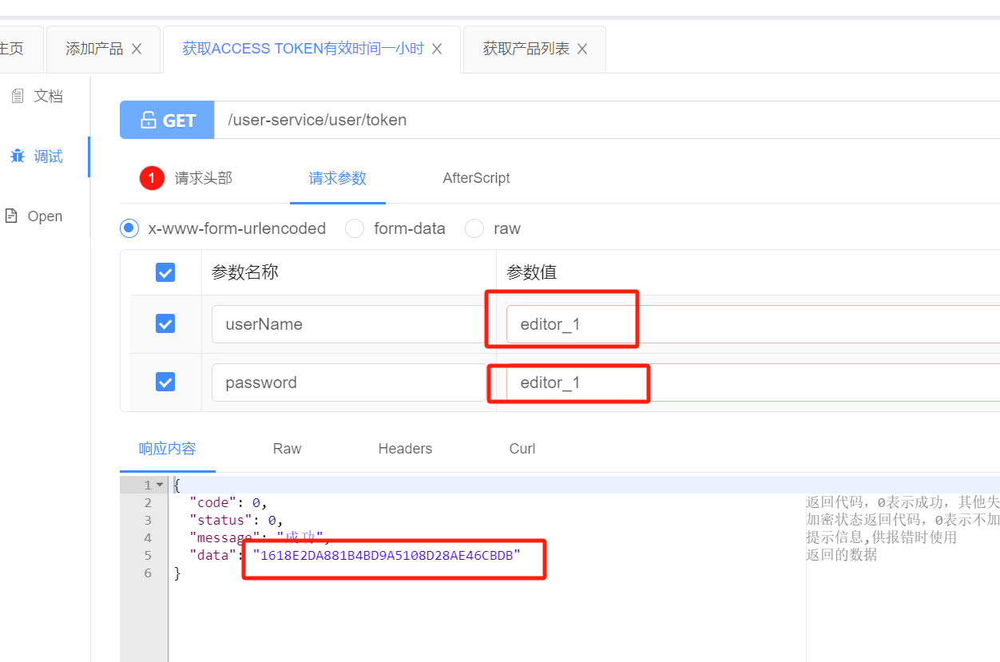

8.使用editor_1用户的token调用接口，修改产品
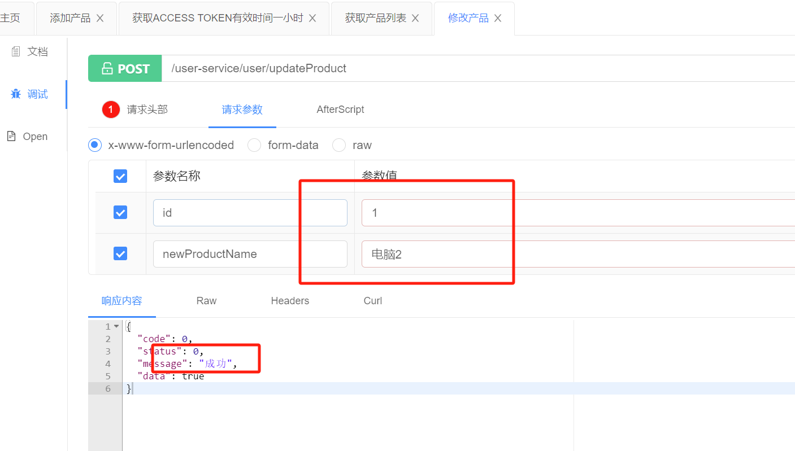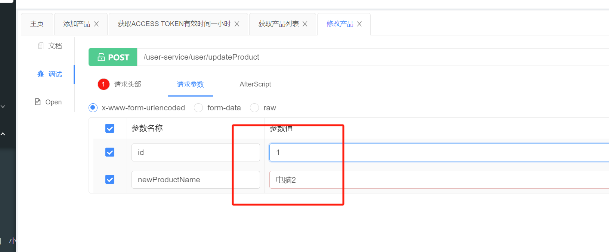

调用接口，获取到列表验证是否修改成功
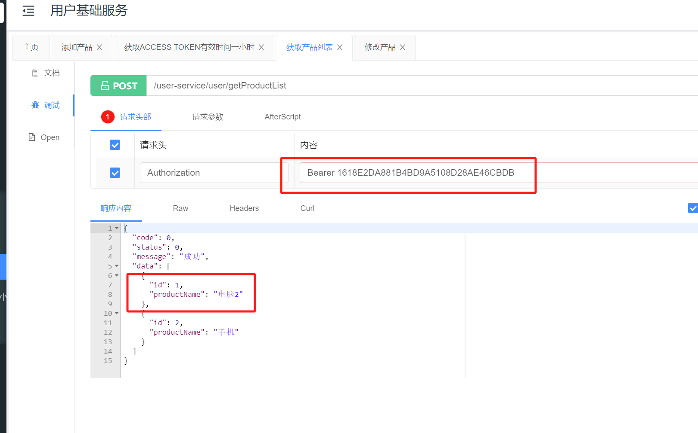

9.删除产品
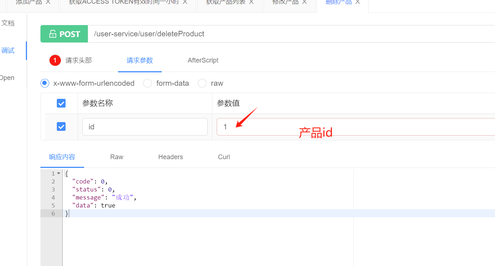
验证是否删除成功
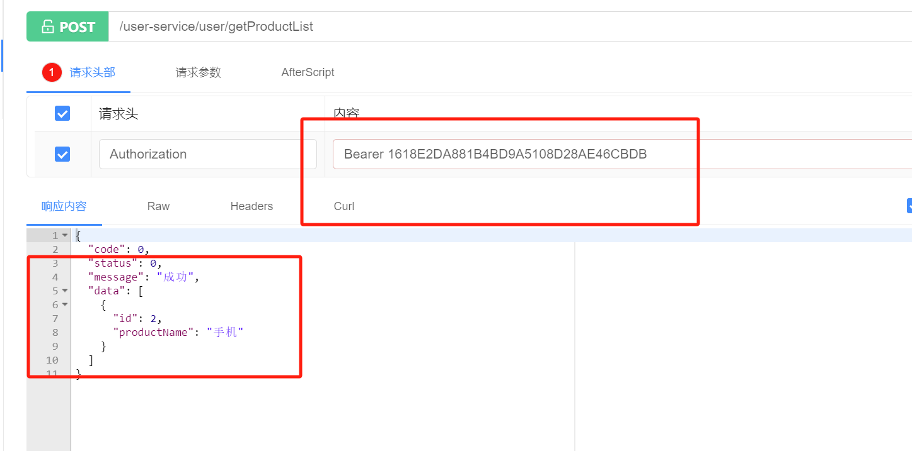